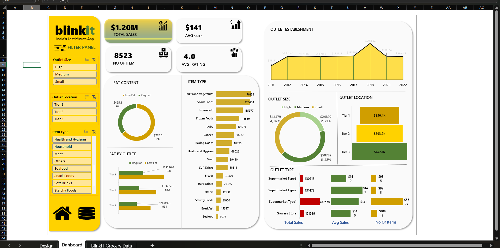

# Blinkit Data Analysis – Unlocking Business Insights Through Data Analytics

## Overview
In today's fast-paced instant delivery world, data-driven decisions are the key to success. This project focuses on analyzing Blinkit's sales data to uncover valuable business insights using Excel's powerful analytics features.

## 🔎 Key Insights Uncovered
Through this analysis, the following critical insights were discovered:
- *$1.2M Total Sales Analysis*: Identified top-selling product categories contributing to revenue.
- *Customer Purchase Trends*: Determined high-demand periods for intelligent inventory planning.
- *Outlet Performance Analysis*: Tier 3 outlets outperformed Tier 1 & Tier 2 in total sales.
- *Risk & Fraud Indicators*: Identified suspicious sales patterns associated with certain outlet types, providing critical fraud insights.

## 💡 Tech Stack Used
For this project, the following tools and techniques were utilized:
- *Power Excel* (Power Query, Pivot Tables, Data Cleaning)
- *Interactive Dashboard Design* for easy-to-use insights
- *Data Storytelling* to effectively communicate complex data in a clear and compelling way

## 🧮 Business Impact
This analysis provided actionable insights that can drive business performance:
- 📊 Enhanced *sales forecasting* to optimize inventory management.
- ⚠ Detected *potential fraud threats* through sales pattern analysis.
- 🎗 Developed *outlet-specific strategies* to drive revenue growth.

## 📸 Dashboard Image

