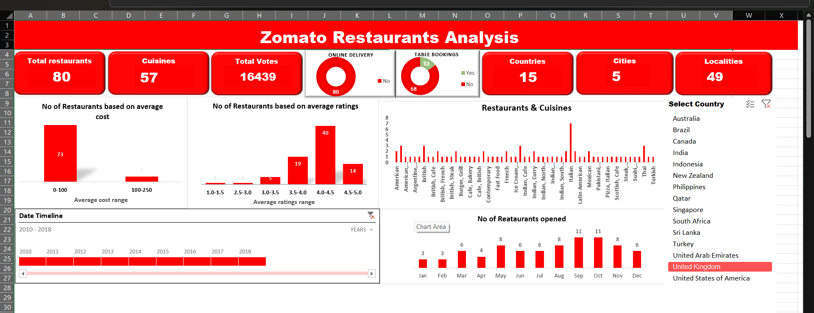

# Zomato Restaurants Analysis – Unlocking Business Insights Through Data Analytics

## Overview
This project involved analyzing Zomato restaurant data using advanced Excel functions, SQL queries, and creating interactive dashboards with Power BI and Tableau. The goal was to extract valuable insights into restaurant industry trends based on location, ratings, pricing, and more.

## 🔎 Key Insights Uncovered
Through this analysis, the following critical insights were discovered:
- *Restaurant Distribution*: Counted restaurants by city and country.
- *Opening Trends*: Analyzed restaurant opening trends by year, quarter, and month.
- *Ratings Analysis*: Counted restaurants based on average ratings.
- *Price Range Buckets*: Created buckets for average price ranges and analyzed restaurant distribution.
- *Service Analysis*: Calculated the percentage of restaurants offering table booking and online delivery.
- *Cuisines & Performance*: Developed charts based on cuisines, cities, and ratings.

## 💡 Tech Stack Used
For this project, the following tools and techniques were utilized:
- *Excel* (SUMIFS, COUNTIFS, PivotTables, VLOOKUP, Conditional Formatting, Report Connections)
- *SQL* (SELECT, FROM, WHERE, GROUP BY, ORDER BY, HAVING, Window Functions, Date Functions)
- *Power BI* (Data Modeling, DAX, Visualizations, Slicers, Filters, Drill-through)
- *Tableau* (Data Blending, Calculated Fields, Dimensions & Measures, Interactive Dashboards)

## 🧮 Business Impact
This analysis provided actionable insights that can drive business performance:
- 📊 Enhanced *sales forecasting* to optimize restaurant operations.
- ⚠ Identified *trends in restaurant openings* and service offerings.
- 🎗 Developed *pricing and marketing strategies* based on customer preferences.

## 📸 Dashboard Image
